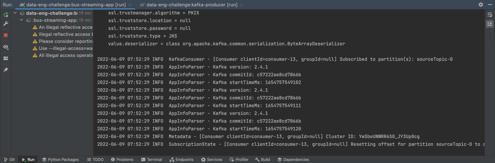
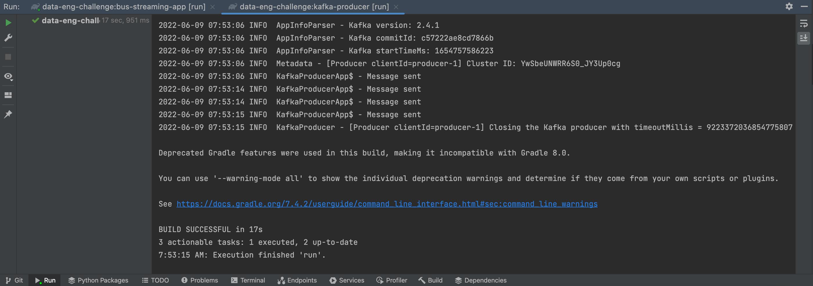
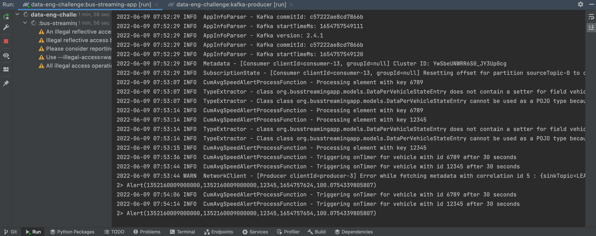
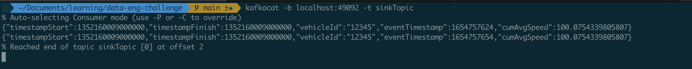

# Data Engineering Challenge

This repository contains a proposed solution to the [Data Engineering Challenge](./Data-Engineering-Challenge.md).
The goal of this challenge is to build a solution that processes the Dublin Bus dataset and emits events within certain 
conditions.

# Tech Stack

This solution uses the following technologies:
- Scala
- Apache Flink
- Apache Kafka
- Gradle
- Docker

Scala was the chosen programming language due to it being a type-safe language and the one I am currently using more
frequently. Apache Flink was the chosen streaming framework as it is a distributed processing engine for stateful 
computations over unbounded and bounded data streams. As we can find on the official website, it "has been designed to 
run in all common cluster environments, perform computations at in-memory speed and at any scale". Flink is implemented
in Java and has its main APIs in Java and Scala. Apache Kafka was the chosen message queue that produces and consumes
events. It is probably the most popular message queue, being also a stream-processing platform. Moreover, Flink has a 
Kafka connector for consuming events from (source) and producing events to (sink) topics.
In order to build the projects, Gradle was the chosen tool. Finally, Docker is also used in order to containerize this 
solution.

Additional used tooling:
- IntelliJ IDEA (IDE)
- kcat: command-line utility that can be used to test and debug Kafka deployments. It allows to produce, consume, and 
list topic and partition information for Kafka.

# The solution

The proposed solution consists of two main modules: kafka-producer-app and bus-streaming-app.

The kafka-producer-app module contains a quite straightforward Scala script that reads the rows from the CSV files, 
converts them to JSON-formatted Strings, and then sends them to a Kafka topic named `source`.
The producer's event-sending rhythm simulates the event's original timestamps. The dataset files are located under 
`kafka-producer/src/main/resources`.

The bus-streaming-app module contains the essential developed work. It contains the code regarding the Flink stream 
processor. The main class is `BusSpeedMonitoringStream` and it has the stream definition: source, processor, and sink.
The stream reads events from the `source` Kafka topic, processes them, and, according to the defined rule, writes an 
alert event to the `sink` Kafka topic. To comply with the requirements, a [KeyedStream](https://nightlies.apache.org/flink/flink-docs-master/api/java/org/apache/flink/streaming/api/datastream/KeyedStream.html) 
and a [KeyedProcessFunction](https://nightlies.apache.org/flink/flink-docs-master/docs/dev/datastream/operators/process_function/#the-keyedprocessfunction) 
were used, in order to perform stateful streaming. By using them, we get access to [keyed state](https://nightlies.apache.org/flink/flink-docs-master/docs/dev/datastream/fault-tolerance/state/#working-with-state)
and timers, i.e., it allows the stream to have a state store and timers for each key. In our case, the key is the
`vehicle_id` field, so that we can keep track of the ever-changing cumulative average speed and maintain a 30-second
timer that will trigger the emission of an alert, if it is the case, for each vehicle.

# Assumptions and decisions

- The events are processed right away, upon being written to the `source` topic.
- Each vehicle has its own state store and timer configuration, meaning that vehicles may have different instants
for which an alert is emitted.
- A windowed stream approach was not used since the main operation is a cumulative one, therefore, there is no need to
aggregate each window's processing results (e.g., calculating the average speed for each bus every 30 seconds). The goal
of this challenge can be achieved with a keyed processor maintaining a state and a timer for each vehicle.
- When a vehicle's cumulative average speed becomes higher than the speed limit, alarms will be produced in intervals of 
30 seconds until the stream processor receives an event that makes the vehicle's cumulative average speed become lower 
than the defined limit. Hence, the `timestampStart` and the `timestampFinish` fields may not contain the "first/last 
event timestamp within 30 second period". 
Imagining that a vehicle's cumulative average speed becomes equal or higher than the limit at some instant,
an alert will be emitted when the next timer is triggered and the timestamp fields of that alert will be set accordingly.
However, if in the next window(s) of time there is no new data for the vehicle, the timestamp fields will remain unchanged,
even when referring to moments for which 30 seconds or more have passed. Moreover, even for different time windows, 
if a new event comes in such that the cumulative average speed remains equal or higher than the limit, only the 
`timestampFinish` is updated, as the infraction began at the first event's timestamp (regardless of the event having been 
received more than 30 seconds ago).

# Demo

Using the following events for the mock vehicles with IDs 12345 and 6789:

````csv
1352160008000000,line_id,0,journey_pattern_id,2012-11-05,vehicle_journey_id,D2,0,-7.257329,53.287521,0.0,block_id,6789,stop_id,0
1352160008000000,line_id,0,journey_pattern_id,2012-11-05,vehicle_journey_id,D2,0,-7.0,53.287000,0.0,block_id,12345,stop_id,0
1352160009000000,line_id,0,journey_pattern_id,2012-11-05,vehicle_journey_id,D2,0,-7.257329,53.287531,0.0,block_id,6789,stop_id,0
1352160009000000,line_id,0,journey_pattern_id,2012-11-05,vehicle_journey_id,D2,0,-7.0,53.287250,0.0,block_id,12345,stop_id,0
````

Start the stream processor application



Start the kafka producer application and send the events



Confirm the output from the Flink job. The alarms are only emitted for the vehicle with ID 12345.



Stop the Flink job and confirm the emitted alerts using kcat to check the `sink` Kafka topic



# Testing
In order to test the stream, run the following commands:

1. Compile and run the kafka producer application:

````bash
gradle :kafka-producer:assemble
gradle :kafka-producer:run
````

2. Compile and run the stream processor:

````bash
gradle :bus-streaming-app:assemble
gradle :bus-streaming-appr:run
````

3. Check the `sink` Kafka topic to confirm that the alerts are correctly emitted:

````bash
kafkacat -b localhost:49092 -t sink
````

# Behaviour tests
The stream processor application contains 2 tests that allow to confirm and test the behaviour of the Flink stream.
To compile and run them use the following commands:

````bash
gradle :bus-streaming-app:compileTestScala
gradle :bus-streaming-app:scalaTest
````

# Docker
This solution is dockerized. In the `docker-compose.yml` file, there are some images such as `static-analysis`, 
`integration-tests`, `kafka-producer`, `and bus-streaming-app`.

The Docker configuration is not optimized. The version of Gradle that runs inside the container is slow and that affects
the behaviour of the applications.

# Improvements
- Create more tests: unit and integration tests
- Allow for greater customization around configurations
- Optimize the Docker configuration, especially regarding Gradle
- Implement a pre-processing stage of incoming events that includes dealing with the problems mentioned in this [article](https://medium.com/tblx-insider/cleaning-the-dublin-buses-dataset-a-tutorial-2783ba2edab4)
- Better error-handling and fault-tolerance
- Integrate with some dashboard in order to allow for better visualization of alerts that go into the Kafka `sink` topic
